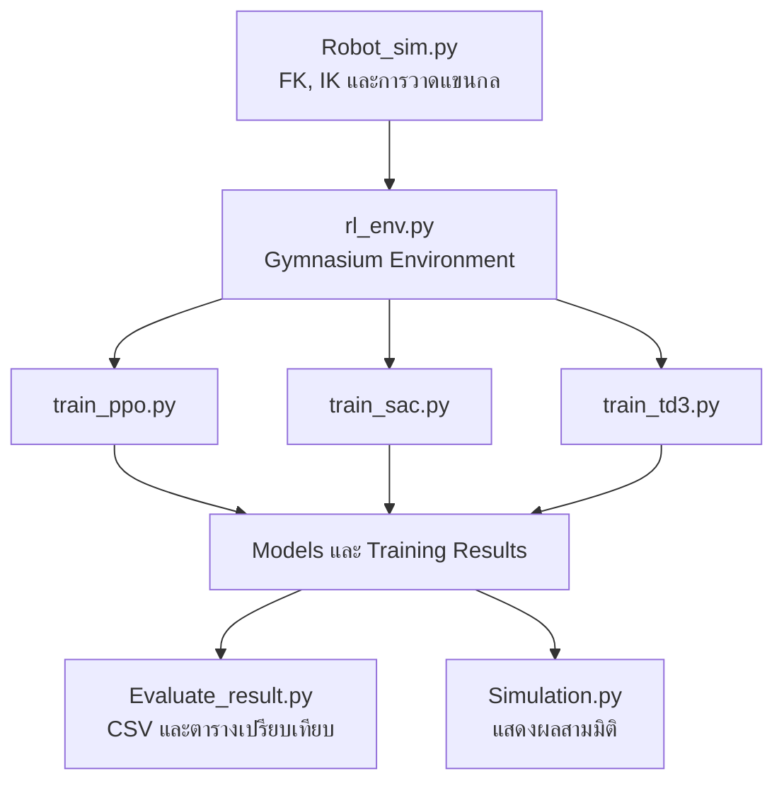

<div align="center">

# 🤖 3DOF Robotic Arm Reinforcement Learning

### ระบบจำลองแขนกล 3 องศาอิสระด้วย PPO, SAC และ TD3


โปรเจกต์สำหรับทดลองควบคุมตำแหน่งปลายแขนกล 3DOF ในพิกัดสามมิติ  
ด้วย Reinforcement Learning แบบ **ไม่มี Physics Engine**

</div>

---

## 📌 ภาพรวมโครงการ

ระบบจำลองแขนกลประกอบด้วยข้อต่อหมุน 3 ข้อต่อ ได้แก่ **Base**, **Shoulder** และ **Elbow** โดยใช้ Forward Kinematics คำนวณตำแหน่ง End effector และใช้ Inverse Kinematics เป็นเครื่องมือช่วยตรวจสอบตำแหน่งเป้าหมาย

ตัวแทน Reinforcement Learning รับข้อมูลสถานะแขนกลและตำแหน่งเป้าหมาย จากนั้นส่งคำสั่งเปลี่ยนมุมข้อต่อเพื่อทำให้ End effector เข้าใกล้เป้าหมายที่สุด โปรเจกต์เปรียบเทียบอัลกอริทึมสำหรับ Continuous Control จำนวน 3 แบบ:

- **PPO — Proximal Policy Optimization**
- **SAC — Soft Actor-Critic**
- **TD3 — Twin Delayed Deep Deterministic Policy Gradient**

> การจำลองนี้เน้น Kinematics และการเปรียบเทียบอัลกอริทึม จึงยังไม่รวมมวล แรงบิด แรงเสียดทาน การชน และแรงโน้มถ่วง

---

## ✨ ความสามารถหลัก

- คำนวณ **Forward Kinematics (FK)** ของแขนกล 3DOF
- คำนวณ **Inverse Kinematics (IK)** แบบ Elbow-up และ Elbow-down
- ปรับมุมข้อต่อแบบ Interactive ด้วย Matplotlib Slider
- ใช้ Custom Environment ตามมาตรฐาน Gymnasium
- รองรับ Action Space แบบต่อเนื่อง 3 ค่า
- ฝึกโมเดล PPO, SAC และ TD3 ด้วย Environment เดียวกัน
- บันทึก Final model, Best model และ Checkpoint ระหว่างฝึก
- บันทึก Replay Buffer สำหรับ SAC และ TD3
- เก็บเวลาฝึก ผลราย Step ผลราย Episode และผลสรุปเป็น CSV
- เปรียบเทียบโมเดลด้วย Seed และชุดเป้าหมายเดียวกัน
- โหลดโมเดลที่ฝึกแล้วและแสดงการเคลื่อนที่แบบ 3 มิติ

---

## 🧩 สถาปัตยกรรมระบบ



---

## 🦾 แบบจำลองแขนกล

| พารามิเตอร์ | ค่า | ความหมาย |
|---|---:|---|
| `L1` | 8 cm | ความสูงฐานถึงหัวไหล่ |
| `L2` | 12 cm | ความยาวท่อนแขนบน |
| `L3` | 10 cm | ความยาวท่อนแขนล่าง |
| Base | −90° ถึง 90° | มุมหมุนรอบแกน Z |
| Shoulder | −10° ถึง 90° | มุมหัวไหล่ |
| Elbow | −120° ถึง 0° | มุมข้อศอก |

### Forward Kinematics

เมื่อกำหนดมุม $\theta_1$, $\theta_2$ และ $\theta_3$ ตำแหน่งปลายแขนคำนวณได้จาก

$$
\begin{aligned}
x &= [L_2\cos(\theta_2)+L_3\cos(\theta_2+\theta_3)]\cos(\theta_1) \\
y &= [L_2\cos(\theta_2)+L_3\cos(\theta_2+\theta_3)]\sin(\theta_1) \\
z &= L_1+L_2\sin(\theta_2)+L_3\sin(\theta_2+\theta_3)
\end{aligned}
$$

---

## 🌐 Reinforcement Learning Environment

| หัวข้อ | รายละเอียด |
|---|---|
| Environment | `PPOArmEnv` หรือ alias `RobotArmEnv` |
| Action Space | `Box(-1, 1, shape=(3,))` |
| Observation Space | เวกเตอร์ต่อเนื่อง 12 ค่า |
| การเปลี่ยนมุมสูงสุด | 4° ต่อข้อต่อต่อ Step |
| จำนวน Step สูงสุด | 150 Steps ต่อ Episode |
| เกณฑ์สำเร็จ | ระยะ End effector ถึง Target ≤ 0.7 cm |
| Target | สุ่มจากมุมที่ถูกต้องเพื่อรับประกันว่าแขนเอื้อมถึง |
| Seed เริ่มต้น | 42 |

### Observation จำนวน 12 ค่า

| กลุ่มข้อมูล | จำนวนค่า |
|---|---:|
| มุมข้อต่อที่ผ่าน Normalization | 3 |
| ตำแหน่ง End effector `(x, y, z)` | 3 |
| ตำแหน่ง Target `(x, y, z)` | 3 |
| Error vector จาก End effector ไป Target | 3 |

### Reward Function

$$
r_t = 15(d_{t-1}-d_t)-0.03d_t-0.01\sum_{i=1}^{3}a_i^2
+100\mathbf{1}[d_t\leq0.7]
$$

โดย Reward ส่งเสริมให้ระยะลดลง ลงโทษระยะที่ยังเหลือและคำสั่งที่รุนแรงเกินจำเป็น และให้โบนัสเมื่อปลายแขนเข้าถึงเป้าหมาย

---

## 🧠 เปรียบเทียบอัลกอริทึม

| คุณสมบัติ | PPO | SAC | TD3 |
|---|---|---|---|
| ประเภท | On-policy | Off-policy | Off-policy |
| Policy | Stochastic | Stochastic | Deterministic |
| Replay Buffer | ไม่ใช้แบบถาวร | ใช้ | ใช้ |
| การสำรวจ | สุ่มจาก Policy | Maximum Entropy | Gaussian Action Noise |
| จุดเด่น | เสถียรและตั้งค่าเริ่มต้นง่าย | ใช้ข้อมูลซ้ำได้และสำรวจดี | เหมาะกับ Continuous Control ที่ต้องการความแม่นยำ |
| ข้อควรระวัง | ใช้ตัวอย่างค่อนข้างมาก | ใช้หลาย Network และคำนวณมากขึ้น | ไวต่อ Noise และ Hyperparameters |

### Hyperparameters ที่ใช้

| Parameter | PPO | SAC | TD3 |
|---|---:|---:|---:|
| Learning rate $\alpha$ | `3e-4` | `3e-4` | `3e-4` |
| Discount factor $\gamma$ | `0.99` | `0.99` | `0.99` |
| Epsilon decay | N/A | N/A | N/A |
| Total timesteps | `100,000` | `100,000` | `100,000` |
| Batch size | `128` | `256` | `256` |
| Network | `[256,256,128]` | `[256,256]` | `[256,256]` |
| Replay buffer | — | `200,000` | `200,000` |
| Learning starts | — | `5,000` | `5,000` |
| Tau | — | `0.005` | `0.005` |
| Exploration | Policy distribution | Entropy `auto` | Gaussian $\sigma=0.1$ |
| ค่าเฉพาะโมเดล | GAE `0.95`, Clip `0.2` | Gradient steps `1` | Policy delay `2`, Target noise `0.2` |

> PPO, SAC และ TD3 ไม่ได้ใช้ Epsilon-greedy ดังนั้นค่า **Epsilon decay เป็น N/A**

---

## 📁 โครงสร้างโปรเจกต์

```text
Simulation_robot_arm_with_RL/
├── Robot_sim.py                 # FK, IK และวาดแขนกล 3D
├── Robot_con_slider.py          # ควบคุมมุมด้วย Slider
├── rl_env.py                    # Gymnasium Environment
├── train_ppo.py                 # ฝึก PPO
├── train_sac.py                 # ฝึก SAC
├── train_td3.py                 # ฝึก TD3
├── Evaluate_result.py           # ประเมินและสร้าง Dataset
├── Simulation.py                # แสดงโมเดลที่ฝึกแล้วแบบ 3D
├── models/                      # Best model และ Checkpoints
│   ├── ppo/
│   ├── sac/
│   └── td3/
├── results/                     # Monitor, CSV และ NPZ
│   ├── ppo/
│   ├── sac/
│   └── td3/
├── robotic_arm_3dof_ppo.zip     # Final PPO model
├── robotic_arm_3dof_sac.zip     # Final SAC model
├── robotic_arm_3dof_td3.zip     # Final TD3 model
├── .gitignore
└── README.md
```

> หากไฟล์ของคุณยังชื่อ `Evalute_result.py` ให้เปลี่ยนเป็น `Evaluate_result.py` เพื่อให้ชื่อถูกต้องและตรงกับคำสั่งใน README

---

## ⚙️ การติดตั้ง

แนะนำให้ใช้ **Python 3.11** และ Virtual Environment

### 1. สร้าง Virtual Environment

```bash
python -m venv .venv
```

Git Bash:

```bash
source .venv/Scripts/activate
```

PowerShell:

```powershell
.\.venv\Scripts\Activate.ps1
```

### 2. ติดตั้ง Library

```bash
python -m pip install --upgrade pip
python -m pip install numpy matplotlib gymnasium stable-baselines3
```

ตรวจสอบว่า VS Code ใช้ Python ตัวเดียวกับ Virtual Environment:

```bash
python -c "import sys; print(sys.executable)"
python -c "import stable_baselines3; print(stable_baselines3.__version__)"
```

---

## ▶️ วิธีใช้งาน

### ทดสอบ FK หรือ IK

กำหนดโหมดใน `Robot_sim.py`:

```python
SIM_MODE = "FK"   # หรือ "IK"
```

จากนั้นรัน:

```bash
python Robot_sim.py
```

### ควบคุมแขนกลด้วย Slider

```bash
python Robot_con_slider.py
```

### ฝึกโมเดล

```bash
python train_ppo.py
python train_sac.py
python train_td3.py
```

ระหว่างฝึก ระบบจะ:

- บันทึก Checkpoint ทุก `25,000` Steps
- Evaluate ทุก `5,000` Steps จำนวน `20` Episodes
- บันทึก `best_model.zip`
- บันทึกเวลาฝึกใน `training_times.csv`
- บันทึก Replay Buffer สำหรับ SAC และ TD3

### ประเมินทั้งสามโมเดล

```bash
python Evaluate_result.py --episodes 100
```

เลือกเฉพาะบางโมเดล:

```bash
python Evaluate_result.py --models ppo sac --episodes 50
```

เลือกแหล่งโมเดล:

```bash
python Evaluate_result.py --model-source best
python Evaluate_result.py --model-source final
```

ค่าเริ่มต้น `auto` จะเลือก Best model ก่อน และใช้ Final model เมื่อไม่พบ Best model

### แสดงผลโมเดลแบบสามมิติ

กำหนดค่าโมเดลใน `Simulation.py`:

```python
MODEL_NAME = "ppo"   # ppo, sac หรือ td3
```

แล้วรัน:

```bash
python Simulation.py
```

---

## 📊 Dataset และผลการประเมิน

ผลการประเมินแต่ละครั้งจะถูกจัดเก็บตาม Run ID:

```text
results/<model>/evaluation/<YYYYMMDD_HHMMSS>/
├── evaluation_steps.csv
├── evaluation_episodes.csv
└── evaluation_summary.csv
```

และสร้างตารางเปรียบเทียบรวม:

```text
results/evaluation_comparison_<YYYYMMDD_HHMMSS>.csv
```

| ไฟล์ | ระดับข้อมูล | ตัวอย่างข้อมูลสำคัญ |
|---|---|---|
| `evaluation_steps.csv` | ทุก Step | มุม, Action, End position, Target, Distance, Reward, Inference time |
| `evaluation_episodes.csv` | ทุก Episode | Total reward, Steps, Success, Initial/Final distance, Episode time |
| `evaluation_summary.csv` | รายโมเดล | Mean reward, Success rate, Mean final distance, Training/Inference time |
| `evaluation_comparison_*.csv` | รวมทุกโมเดล | ตาราง PPO, SAC และ TD3 ภายใต้ชุด Seed เดียวกัน |

### ตัวชี้วัดหลัก

| ตัวชี้วัด | การตีความ |
|---|---|
| Mean Reward | ยิ่งสูงยิ่งดี เมื่อใช้ Reward Function เดียวกัน |
| Success Rate | ร้อยละของ Episode ที่ระยะสุดท้ายไม่เกิน 0.7 cm |
| Mean Final Distance | ยิ่งต่ำยิ่งแสดงว่าปลายแขนเข้าใกล้เป้าหมาย |
| Mean Episode Length | ค่าต่ำร่วมกับ Success Rate สูง แสดงว่าเข้าถึงเป้าหมายเร็ว |
| Training Time | เวลาที่ใช้ฝึกโมเดลทั้งหมด |
| Mean Inference Time | เวลาที่โมเดลใช้สร้าง Action หนึ่งครั้ง |

### ตารางผลทดลอง

ให้นำค่าจาก `evaluation_comparison_*.csv` มาเติมหลังจากประเมินเสร็จ:

| Model | Mean Reward | Success Rate (%) | Mean Final Distance (cm) | Training Time (s) | Mean Inference (ms) |
|---|---:|---:|---:|---:|---:|
| PPO | — | — | — | — | — |
| SAC | — | — | — | — | — |
| TD3 | — | — | — | — | — |

---

## 🔁 ความยุติธรรมในการเปรียบเทียบ

- ทุกโมเดลใช้ Environment และ Reward Function เดียวกัน
- ใช้จำนวน Training timesteps เท่ากันที่ 100,000 Steps
- ใช้ Training seed เริ่มต้นเป็น 42
- Evaluation ใช้ Episode seed ชุดเดียวกันทุกโมเดล
- ใช้ `deterministic=True` ระหว่างการประเมิน
- ควรทดลองอย่างน้อย 5 Seeds และรายงานค่าเฉลี่ยกับส่วนเบี่ยงเบนมาตรฐานก่อนสรุปว่าโมเดลใดดีที่สุด

---

## ⚠️ ข้อจำกัด

- ไม่มี Physics Engine จึงไม่จำลองแรง มวล แรงบิด และแรงเสียดทาน
- ไม่มี Collision Detection หรือสิ่งกีดขวาง
- Observation ยังไม่มีความเร็วเชิงมุมและความเร็วปลายแขน
- Joint limits เป็นค่าที่กำหนดสำหรับการทดลอง ไม่ได้อ้างอิงแขนกลจริงรุ่นใดรุ่นหนึ่ง
- Target ถูกสร้างจาก FK จึงเป็นตำแหน่งที่แขนเอื้อมถึงได้

---

## 🚀 แนวทางพัฒนาต่อ

- [ ] ประเมินหลาย Seeds และสร้างกราฟ Mean ± Standard Deviation
- [ ] เพิ่ม Learning Curve, Success Rate และ Final Distance Plot
- [ ] เพิ่ม Hyperparameter Tuning
- [ ] เพิ่ม Collision Detection และสิ่งกีดขวาง
- [ ] ย้ายแบบจำลองไปยัง PyBullet หรือ MuJoCo
- [ ] เพิ่ม Sensor Noise และ Domain Randomization
- [ ] เปรียบเทียบ RL กับ IK Controller แบบดั้งเดิม
- [ ] ทดลองถ่ายโอน Policy ไปยังแขนกลจริง

---

## 🧰 เทคโนโลยีที่ใช้

- Python 3.11
- NumPy
- Matplotlib
- Gymnasium
- Stable-Baselines3
- PyTorch
- Visual Studio Code
- Git และ GitHub

---

<div align="center">

โครงการนี้จัดทำเพื่อการศึกษา Reinforcement Learning และการควบคุมแขนกลแบบต่อเนื่อง

⭐ หากโปรเจกต์นี้มีประโยชน์ สามารถกด Star เพื่อสนับสนุนโครงการได้

</div>

